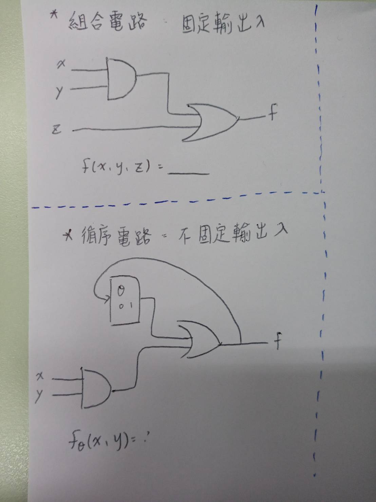

# 人工智慧大部分使用的幾種方法(人工智慧的簡介)
## 比對法:
* 例如:eliza:模擬真人對話，甚至能夠騙過真人

## 推理法:
* 撰寫規則，電腦椅距規則進行推論
* eg:專家系統(用電腦來解決人的問題)
    1. 例如醫學上使用專家系統開抗生素比人來得好
    2. 例如電腦出現問題，可以使用專家系統推理出問題，會請我們操作一些測試之類

## 搜尋法:
* 對所有可能結果進行系統式的列舉(深度搜尋，廣度搜尋)
* eg: 1. 拼圖(如何把拼圖拼成我們所希望的樣子)
   2. 下棋(找出我與對手的所有可能歷盡)，minmax推算法，尋找自己的最高分，和對方的最低分來下
   
## 統計法:根據統計資料，找出最有可能的答案，最有可能結合推理搜尋
* eg:蒙利卡羅法推論出圓周率

## 優化法:給一切都給分數，找出分數最高的
* eg 
   1. 電腦下棋
   2. 機器辨識
   3. 影像辨識
   4. 爬山演算法(尋找最高點)
   5. 梯度下降法(連續可微函數才能用梯度下降法)
   5. 神經網路(優化線和點上的距離)點+線+閘(SUM,OR...)
   CNN，GAN ，ReLU(讓高於某個門檻的訊號通過) .RNN(最常用來處理語言，下是機器翻譯系統)..循環神經網路(可學習論文或是書本甚至linux，用來進行創造)
   (最新型的神經網路，稱為生成對抗網路(GAN):常常用於偉造，可用來將自己繪製的圖片畫成真實世界的圖片，學習人臉)
   6. 反傳遞演算法(使用鏈鎖規則)
   AlphoGo(強化學習+神經網路+蒙地卡羅法)

