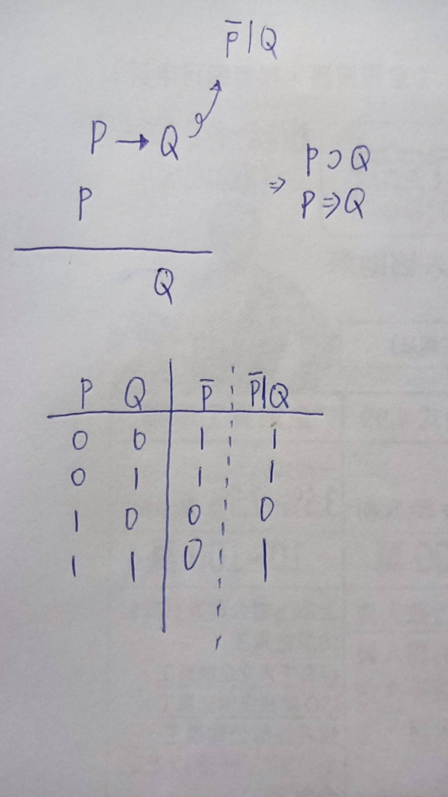
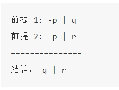

# 上課筆記
## Part one
### 希爾伯特的23個問題
* [參考資料-希爾伯特的23個問題](https://zh.wikipedia.org/wiki/%E5%B8%8C%E5%B0%94%E4%BC%AF%E7%89%B9%E7%9A%8423%E4%B8%AA%E9%97%AE%E9%A2%98)
* 提出了23個問題，今天主要是第2個問題

* 哥德爾不完備定理，哥德爾如果用+或-是完備的，但是*或/會錯

### 希臘三哲
* 三段式論:e.g.人都會死(大前提)+蘇是人(小前提) = 蘇會死

>* (P -> Q) + (P) = Q

* 如圖

- 如何找出完備的推論法則，透過此法則可以推論出所有布林邏輯的定理，如下圖

- 但是可以推論出所有邏輯的定理的推論過程不完備

* [參考資料-布林邏輯](https://ccckmit.gitbooks.io/rlab/content/axiom.html)

- 一階邏輯推論 : 一致且完備，但是加上乘號後出現問題

---

## part three

* kb.py
* kb.Reason:專家系統-前向推論程式
* kbTest:測試結果 
- kbQuery.py :
專家系統-互動推論程式 : 透過與使用者互動之方式(輸入隱含前提)，並讓"推理引擎"推論出結果

[專家系統，程式碼](https://gitlab.com/ccc110/ai/-/tree/master/04-logic)