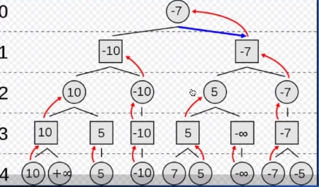
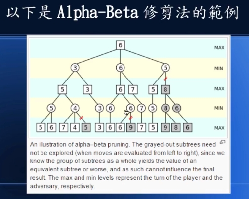

# 蒙地卡羅:機率式搜尋
- [電腦下棋-程式碼位置](https://gitlab.com/ccc110/ai/-/tree/master/12-chess)
* Alphago :做出完美的評估函數
* 算整局棋盤的分數:防守+攻擊分數
* 透過盤面評估函數做出來，這些是透過從下面往上尋找，方形是取小，圓形是取大來進行(是透過進攻防守來進行)
* 透過幾何級數生長
* 下圖(來自鍾誠老師的ppt)偶數層，代表我方，奇數層，代表對方下子，可以透過DFS(廣域搜尋)

* 下圖(來自鍾誠老師的ppt):Alpha-Beta修剪法，從底下往上看

* AlphaGo：通過間督式學習（supervised learning），學習人類的棋譜，也就是類似於看書來解題。
* AlphaZero：通过強化學習(Reinforcement learning)的方法, 只從遊戲規則之中學習。完全不依靠人類知識，運用自己對打自己去進行學習。

* Minimax(零和遊戲)

* 期中確認:下棋(試試16*16)
* train.py : 訓練
* human_play.py : 測試

---
## 論文寫作:
- 論文參考文獻/資料搜尋，可以在這邊尋找:https://www.semanticscholar.org/

- 論文寫作可以使用LaTex進行編譯，有中文的話可以透過CLatex進行製作

- 鍾誠老師，實作LaTex論文範例: https://github.com/cccresearch/nnModelAuto

