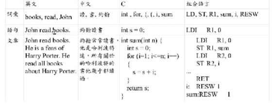

# 語言處理技術

### 自然語言
- 維基百科中。例如中文、英文、日文等語言
- HTML vs XML(結構較複雜會使用)
- XML : 使用標記法將結構標記起來

### 人造語言
- 例如 : 機器語言、組合語言、C語言、python...

### 語言的層次

- 無論哪種語言都具有"詞彙、語句、文章"等三個層次(如下圖，來自中鍾誠老師投影片)

### 自然語言處理
- google翻譯等，需多都使用自然語言處理來進行

- 透過許多名人佳句組成一些佳句 庫，並加上一些轉折語句的組成，能形成出感覺沒什麼意義但是卻又合理的文章。

- [範例程式(e2c.py)](https://gitlab.com/ccc110/ai/-/tree/master/11-lang/rule/02-lookup)

- [自然語言處理其他範例](https://gitlab.com/ccc110/ai/-/tree/master/11-lang/rule)