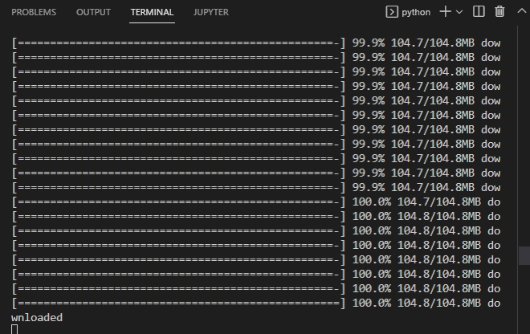

### 語意辨識
- 上課內容 : [鍾誠老師-ppt](https://speakerdeck.com/ccckmit/yu-yan-chu-li-ji-shu)

- 語音測試 : 隱馬可夫模型 -> 深讀學習

- 自然語言處理 : 喬姆斯基(提出深層語法，名叫context-free grammer(Chomsky))
- [參考程式碼位置(11-lang/rule/03-gen)](https://gitlab.com/ccc110/ai/-/tree/master/11-lang/rule/03-gen) 
- 以下為上課練習測試結果
    ```
    s1108@DESKTOP-IJI9NA5 MINGW64 /d/Vscode/AI110/ai/11-lang/rule/03-gen (master)
    $ python gen1.py 
    ['a', 'cat', 'eat', 'the', 'cat'] 0.031250
    ['a', 'cat', 'chase', 'a', 'dog'] 0.031250
    ['the', 'cat', 'eat', 'a', 'cat'] 0.031250
    ['a', 'cat', 'chase', 'a', 'cat'] 0.031250
    ['the', 'cat', 'chase', 'the', 'cat'] 0.031250
    ['the', 'dog', 'chase', 'the', 'cat'] 0.031250
    ['the', 'dog', 'eat', 'a', 'dog'] 0.031250
    ['the', 'dog', 'eat', 'the', 'dog'] 0.031250
    ['the', 'cat', 'eat', 'the', 'dog'] 0.031250
    ['a', 'dog', 'eat', 'a', 'cat'] 0.031250
    ```
- [參考資料(李弘毅老師)-ppt](http://speech.ee.ntu.edu.tw/~tlkagk/courses_ML20)


- 自然語言的語意 : 如果用格式化的方式去教他，較差，就像AlphaZero比AlphaGo ，所以給一些規則讓他自己學習較好

- 循環神經網路(RNN)，預測下一件事

- 詞向量模型(word Embedding) 用300維的詞向量代表一個字

- 在幾百維中，每個空間都有它代表的一個位置


---

### 程式執行了解
- [老師範例程式位置](https://gitlab.com/ccc110/ai/-/tree/master/11-lang/nn/01-word2vec/01-gensim)
- 先安裝gensim `pip install gensim`

- pretrained.py
- 要先載入 model keys()))
    model = gensim.downloader.load('
    ```
    import gensim.downloader
    # Show all available models in gensim-data
    # print(list(gensim.downloader.info()['models'].keys()))
    model = gensim.downloader.load('glove-twitter-25')

    print(f"model.most_similar('twitter')={model.most_similar('twitter')}")
    print(f"model.most_similar('dog')={model.most_similar('dog')}")
    print(f"model.most_similar('mother')={model.most_similar('mother')}")
    print(f"model.most_similar('king')={model.most_similar('king')}")
    print(f"model.most_similar('push')={model.most_similar('push')}")
    print(f"model.most_similar(positive=['woman', 'king'], negative=['man'])={model.most_similar(positive=['woman', 'king'], negative=['man'])}")

    ```

- 接著`python pretrained.py`，這會需要下載一些時間

    
    


### huggingface & transformers
- [huggingface網址](https://huggingface.co/docs/transformers/task_summary)

- 抽取式問答 : 從文章中抽一些來回答，類似讓電腦做閱讀測驗

- 聲音識別(給一段音檔，識別出整段文章)、語言處理


### 其他參考資料

http://karpathy.github.io/

[虛擬環境與套件](https://docs.python.org/zh-tw/3/tutorial/venv.html?fbclid=IwAR3ijHqnh0sa9NTfKpvvcrmuW9hb2Fu_7U-yTXAqEygIMSeRmA4ndXJDO0k)