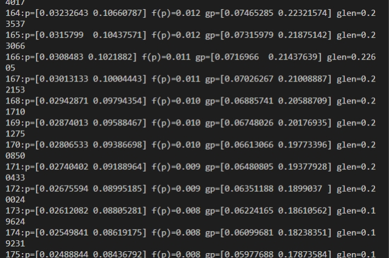
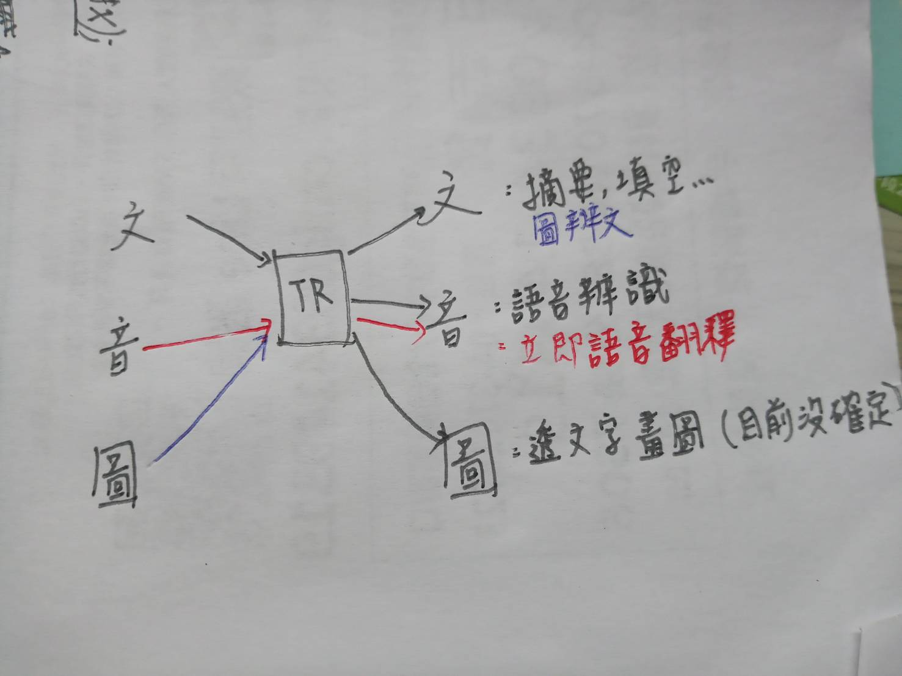

## 神經網路簡介

[參考資料]((https://kinmen6.com/root/%E9%99%B3%E9%8D%BE%E8%AA%A0/%E8%AA%B2%E7%A8%8B/%E4%BA%BA%E5%B7%A5%E6%99%BA%E6%85%A7/07-neural/)


### 梯度
1. 微分例子(單變數)

- [鍾誠老師程式碼位址-/07-neural/02-gradient/01-diff](https://gitlab.com/ccc110/ai/-/tree/master/07-neural/02-gradient/01-diff)

- 執行結果
```m
s1108@DESKTOP-IJI9NA5 MINGW64 /d/Vscode/AI110/ai/07-neural/02-gradient/01-diff (master)
$ python diff.py 
diff(f,2)= 12.006000999997823
```

2. 偏微分(多變數):f對第X變數的偏微分

- [鍾誠老師程式碼位置-/07-neural/02-gradient/02-gradient/npGradient.py](https://gitlab.com/ccc110/ai/-/blob/master/07-neural/02-gradient/02-gradient/npGradient.py)
```py
# 函數 f 對變數 p[k] 的偏微分: df / dp[k]
def df(f, p, k):
    p1 = p.copy()
    p1[k] = p[k]+step
    return (f(p1) - f(p)) / step

```

3. 梯度:對每個變數都取它的偏微分(就是一個向量)

4. 梯度下降法:一階最佳化算法，常常用來尋找區域最小值，爬山演算法則相反，常常用來尋找區域最大值(梯度消失則停止)
- [鍾誠老師程式碼位址-/07-neural/02-gradient/03-gd/gd1.py](https://gitlab.com/ccc110/ai/-/blob/master/07-neural/02-gradient/03-gd/gd1.py)，用來解最低點
    ```py
    # 使用梯度下降法尋找函數最低點
    def gradientDescendent(f, p0, step=0.01):
        p = p0.copy()
        i = 0
        while (True):
            i += 1
            fp = f(p)
            gp = grad(f, p) # 計算梯度 gp
            glen = norm(gp) # norm = 梯度的長度 (步伐大小)
            print('{:d}:p={:s} f(p)={:.3f} gp={:s} glen={:.5f}'.format(i, str(p), fp, str(gp), glen))
            if glen < 0.00001:  # 如果步伐已經很小了，那麼就停止吧！
                break
            gstep = np.multiply(gp, -1*step) # gstep = 逆梯度方向的一小步
            p +=  gstep # 向 gstep 方向走一小步
        return p # 傳回最低點！

    ```
    - 執行以下`python gdTest.py`
    

    - 執行以下(處理損失函數之值，加上動量) : `python gdEquation1.py` 

### 現在transformer有用到的




---

- 回家可以預習以下文章(簡單講反傳遞) : 家法器、減法器，如何逆推...

http://karpathy.github.io/neuralnets/


