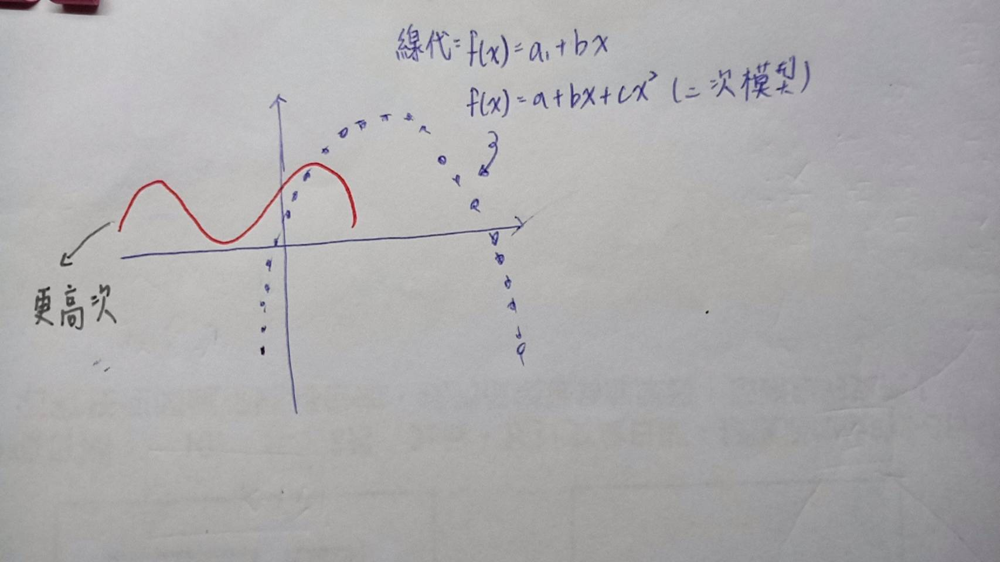

下載[pytouch]( https://pytorch.org/) 

- [程式碼範例區區域](https://gitlab.com/ccc110/ai/-/blob/master/07-neural/06-torchGd/torchGd1.py)

---
### 回歸範例

- [pytouch Example](https://pytorch.org/tutorials/beginner/pytorch_with_examples.html)

1. loss先算出來(正向運算) : loss = np.square(y_pred - y).sum()

2. 有了loss最後那層就是我們的預設梯度 :  grad_y_pred = 2.0 * (y_pred - y)

3. 去算包含每個變數的梯度運算，包含a,b,c,d
    ```py
        grad_a = grad_y_pred.sum()
        grad_b = (grad_y_pred * x).sum()
        grad_c = (grad_y_pred * x ** 2).sum()
        grad_d = (grad_y_pred * x ** 3).sum()
    ```

4. 對每一個一步一步的調整，就可以算出最好的梯度值
    ```py
        a -= learning_rate * grad_a
        b -= learning_rate * grad_b
        c -= learning_rate * grad_c
        d -= learning_rate * grad_d
    ```

- 下面為詳細程式碼
```py
# -*- coding: utf-8 -*-
import numpy as np
import math

# Create random input and output data
x = np.linspace(-math.pi, math.pi, 2000)
y = np.sin(x)

# Randomly initialize weights
a = np.random.randn()
b = np.random.randn()
c = np.random.randn()
d = np.random.randn()

learning_rate = 1e-6
for t in range(2000):
    # Forward pass: compute predicted y
    # y = a + b x + c x^2 + d x^3
    y_pred = a + b * x + c * x ** 2 + d * x ** 3

    # Compute and print loss
    loss = np.square(y_pred - y).sum()
    if t % 100 == 99:
        print(t, loss)

    # Backprop to compute gradients of a, b, c, d with respect to loss
    grad_y_pred = 2.0 * (y_pred - y)
    grad_a = grad_y_pred.sum()
    grad_b = (grad_y_pred * x).sum()
    grad_c = (grad_y_pred * x ** 2).sum()
    grad_d = (grad_y_pred * x ** 3).sum()

    # Update weights
    a -= learning_rate * grad_a
    b -= learning_rate * grad_b
    c -= learning_rate * grad_c
    d -= learning_rate * grad_d

print(f'Result: y = {a} + {b} x + {c} x^2 + {d} x^3')
```



---

- 梯度下降法程式範例
- [參考程式範例位置-/07-neural/07-torchRegression/example/](https://gitlab.com/ccc110/ai/-/blob/master/07-neural/07-torchRegression/example/)

---
### 平均值的估計與檢定
- 如果研究所需要進行機率等預測或是檢定，平均值的估計與檢定重要
- [平均值的估計與檢定](https://kinmen6.com/root/%E9%99%B3%E9%8D%BE%E8%AA%A0/%E6%9B%B8%E7%B1%8D/%E6%A9%9F%E7%8E%87%E7%B5%B1%E8%A8%88/test1.md)

- 信賴區間 : 一個範圍，在這個範圍所占的面積，一般來說我們會取95%的信賴區間

- 平均值的信賴區間 : 任何的機率分布，只要取n個做平均，都會偏向常態分布

- T分布做檢定

