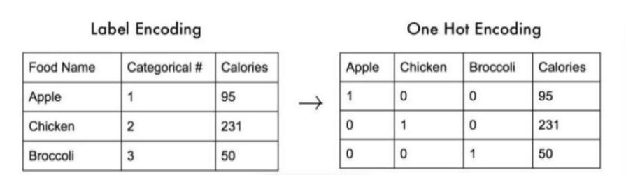

# Introduction of Machine / Deep Learning

## 機器學習 就是去尋找函數
1. 語音辨識 : 語音 -> 字串
2. 影像 -> 物體類別
3. 下棋 -> 將整個棋盤矩陣，將所想要的轉乘棋盤位置

## 函數的型態大多分為兩類
1. Regression(最小平方法，找出那兩個數值的差)
想要預測接下來的值是哪一個:天氣預測、股市預測

輸出一個值(強度)
棋盤 : 只需19*19類就可以

2. Classification(softmax: 最後的輸出和one hot之間的關係)
輸出有幾類就是有幾點
輸入輸出是一堆類別(沒有強度的類別)
>* One Hot Encoding : 把每個類別新增一個欄位，用0/1來表示
 
[圖片來至此網址](https://medium.com/@PatHuang/%E5%88%9D%E5%AD%B8python%E6%89%8B%E8%A8%98-3-%E8%B3%87%E6%96%99%E5%89%8D%E8%99%95%E7%90%86-label-encoding-one-hot-encoding-85c983d63f87)

## Loss
- 深度學習希望能輸出一個標準答案
- 深度學習中常常會定義一個損失函數，越接近標準答案越好
- 類似考試評分標示，答對給分，答錯扣分

- 定義損失函數時大多分為兩類
    - softmax + CrossEntropy
    - 最小平方法

## 優化(Optimization)

- 常常使用梯度下降法
使用動量機制，可能會穿過去，這樣的好處是有可能能找到更低點

- 學習的過程盡量降低損失

- Sigmoid(學習的範圍只有一小段，較容易梯度消失)

- relu (較不容易產生梯度消失)

- 深度學習 : 使用新的架構:向relu，pooling，它的深度變深，網路變大

## Machine Learning 步驟
1. function with unknown(學習一些不知參數的函數)

2. define loss from training data

3. optimization(學習的過程)
盡量降低損失

## Why "deep learning"
- 層數變深
- 不見得越深越好，但如果加深能變好的話，能改變成更好，那就是更好的方法

參考資料 : 
[李宏毅老師ML-ppt](chrome-extension://bocbaocobfecmglnmeaeppambideimao/pdf/viewer.html?file=https%3A%2F%2Fspeech.ee.ntu.edu.tw%2F~hylee%2Fml%2Fml2021-course-data%2Fregression%2520(v16).pdf)

---

## Framework of ML

- 例如:語音辨識，圖片辨識，讀者辨識、...

- 希望得到的Loss 最小
網路輸出跟標準答案的輸出差異就是損失

- model 不夠好 : 草叢沒針，一直在找針
- optimatization : 草叢有針，只是找不到

- Overfitting: 
    1. 幾乎都把答案背起來了 
    2. 給的函數自由度太大(建議在函數的設計上用同樣的向次函數)，捲機神經網路比多層感知器的好處是CNN的參數共享

[李宏毅老師Framework of ML-ppt](https://speech.ee.ntu.edu.tw/~hylee/ml/ml2021-course-data/overfit-v6.pdf)

---

## When gradient is small(當梯度很小時該怎麼辦?)
- 一次向泰勒展開式
- 二次向Hession H ，梯度很小時，g為0那只會看H值
- Gradient Descent + Momentum(梯度 + 動量)
- Saddle Point vs Local Minima
    - Saddle Point : 只要有一個特徵值是負的其他都是正的沒關係，那該負的特偵值及為鞍點(Saddle Point)

- 適當的設定Batch值會對訓練有所幫助
- 一個epochs會跑多少Batch的數量，太多太少都沒有很好

[李宏毅老師Small gradient - ppt](https://speech.ee.ntu.edu.tw/~hylee/ml/ml2021-course-data/small-gradient-v7.pdf)

---

學習步伐太大，會產生學習速率問題
Root Mean Square :動態調整，讓不乏平滑化

https://speech.ee.ntu.edu.tw/~hylee/ml/ml2021-course-data/optimizer_v4.pdf

---

## Classification(Short Version)

- 使用Cross-entropy搭配softmax會比較好 比 最小平方好
交叉商
- 最大概是估計
- cross-entropy的最小化，等於機率統計的最大化

[李宏毅老師Classification - ppt](https://speech.ee.ntu.edu.tw/~hylee/ml/ml2021-course-data/classification_v2.pdf)

---

- 其他參考資料 :
[ConvNetJS](https://cs.stanford.edu/people/karpathy/convnetjs/
) 
[李宏毅老師ppt](https://speech.ee.ntu.edu.tw/~hylee/ml/2021-spring.php)
[計算統計學簡介](http://ccckmit.wikidot.com/st:computationalstatistics)

