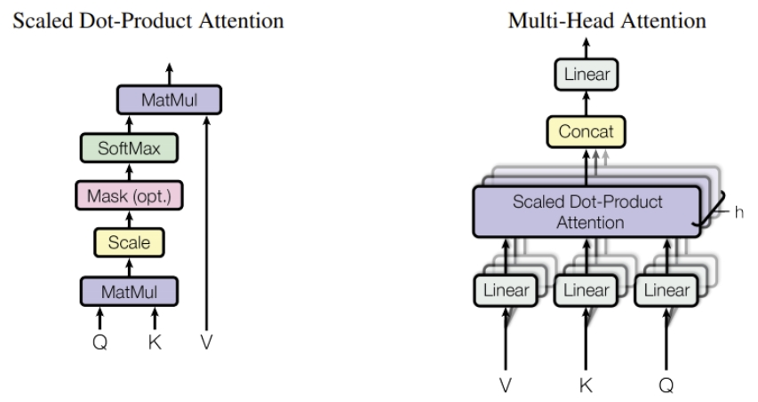

## CNN & self-attention(transformer)
### CNN
- 只要跟影像處理有關，大多用CNN來做

- 常使用 捲積 、 relu 、全連階層來做

- 讀CNN時建議對照[convnetjs](https://cs.stanford.edu/people/karpathy/convnetjs/demo/mnist.html)來理解

- 深度學習有兩大模型 : 捲積 & 循環神經網路(最後大多被transformer所取代)

### self-attention
- 簡單常常用One-Hot Encoding來做
- 詞彙有距離及相似度，常常會進行分群


[李弘毅老師 CNN-ppt](chrome-extension://bocbaocobfecmglnmeaeppambideimao/pdf/viewer.html?file=https%3A%2F%2Fspeech.ee.ntu.edu.tw%2F~hylee%2Fml%2Fml2021-course-data%2Fcnn_v4.pdf)
[李弘毅老師 self-attention-ppt ](chrome-extension://bocbaocobfecmglnmeaeppambideimao/pdf/viewer.html?file=https%3A%2F%2Fspeech.ee.ntu.edu.tw%2F~hylee%2Fml%2Fml2021-course-data%2Fself_v7.pdf)

---

### GAN(Generative Adversarial Nets)
- 深度偉裝技術
- 鑑別者盡量找出誰是偽造的
- 偽造者盡量讓鑑別者找不出來
- GAN影片之介紹
    - 1. 輸入一個東西，希望能生成結果 : 分成前向傳播網路、分析圖片的捲積神經網路，也有分析語音等的RNN神經網路

    - 2. 希望能憑空捏造結果的 : GAN

- [老師提供的範例程式碼](https://gitlab.com/ccc110/ai/-/tree/master/08-deep/05-gan/01-gan_mnist)裡面時做了手寫辨識數字創作出來的過程

- GAN : 通常是用來做偽造，偉造是我們常希望得到的目標


- [李弘毅老師 self-attention-ppt](https://speech.ee.ntu.edu.tw/~hylee/ml/ml2021-course-data/gan_v10.pdf)

- [GAN的介紹 ](https://mofanpy.com/tutorials/machine-learning/torch/intro-GAN/)

---
# 介紹程式碼

## 做影像分類
- [程式碼位址](https://gitlab.com/ccc110/ai/-/tree/master/08-deep/02-pretrained/01-torchvision/01-classify)
- 執行方式及結果 (python predict.py alexnet/resnet18 img/yourpicture.jpg)
    ```
    s1108@DESKTOP-IJI9NA5 MINGW64 /d/Vscode/AI110/ai/08-deep/02-pretrained/01-torchvision/01-classify (master)
    $ python predict.py alexnet img/dog.jpg
    img_t.shape= torch.Size([3, 224, 224])
    batch_t.shape= torch.Size([1, 3, 224, 224])
    preds.shape= torch.Size([1, 1000])
    Labrador retriever
    (tutorial-env) 
    s1108@DESKTOP-IJI9NA5 MINGW64 /d/Vscode/AI110/ai/08-deep/02-pretrained/01-torchvision/01-classify (master)
    $ python predict.py alexnet img/cat.jpg
    img_t.shape= torch.Size([3, 224, 224])
    batch_t.shape= torch.Size([1, 3, 224, 224])
    preds.shape= torch.Size([1, 1000])
    Egyptian cat
    (tutorial-env) 
    ```

## 循環神經網路例子
- [程式碼位址](https://gitlab.com/ccc110/ai/-/tree/master/08-deep/04-rnn/01-language_model)
---


## transformers
- 簡單實作這篇transformer
- 測試簡單亂數之例子
- 具有attention的概念，Q*K之後進行Mask，接著經過softmax ，最後經過矩陣相乘乘上V



- 圖片參考於此 : [transformers](https://medium.com/the-dl/transformers-from-scratch-in-pytorch-8777e346ca51)


- 其他參考資料


https://pytorch.org/


[李弘毅老師投影片](https://speech.ee.ntu.edu.tw/~hylee/ml/2021-spring.php)
