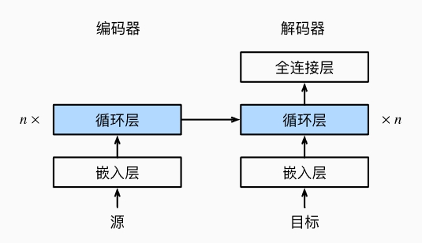

循環神經網路
會不亂輸出他學到的東西，也就是數學運算式


- 

1. 一開始建立語料庫(Corpus)

2. 接著取得資料(train.txt)

3. 並且建立字典(dictionary)

4. 接著經過One Hot Encoding

5. 假設將100維丟進會，會經過循環神經網路(RNNLM)

6. 接著，透過softmax計算Lose

7. 梯度下降法的優化


## 
透過 產生數學式的訓練集
產生英翻中的訓練集
qa_train.txt : 得到句子的長度
summary_train.txt : 人文設計產生的摘要系統訓練集

### 訓練
1. 將詞輸入進來

2. 通通變成向量

3. 梯度下降法

### 預測

1. 有時給段詞 去前導(此範例沒有前導，隨機選一個當前導)

2. 接著呼叫model

3. 給定輸入進行輸出

- 執行方式
    ```
    python main english train
    python main english test
    ```
- 執行結果
    ```
    s1108@DESKTOP-IJI9NA5 MINGW64 /d/Vscode/AI110/ai/08-deep/04-rnn/02-language_model2 (master)
    $ python main.py english train
    tokens= 5231
    len(ids)= 5231
    ids.size(0)= 5231
    batch_size= 20
    num_batches= 261
    len(ids)= 5220
    ids.shape= torch.Size([20, 261])
    vocab_size= 13
    Epoch [1/3], Step[0/8], Loss: 2.5691, Perplexity: 13.05
    Epoch [2/3], Step[0/8], Loss: 1.3407, Perplexity:  3.82
    Epoch [3/3], Step[0/8], Loss: 1.2980, Perplexity:  3.66
    ```

- [karpathy-rnn參考資料](http://karpathy.github.io/2015/05/21/rnn-effectiveness/)，訓練linux語言，能生出linux語言，訓練論文，能產生一種可編譯的latex程式...。


- [程式碼參考資料](https://gitlab.com/ccc110/ai/-/tree/master/08-deep/04-rnn/03-rnn_qa)

- 執行方式透過 `python main.py qa train` & `python main.py qa qa`  
```
s1108@DESKTOP-IJI9NA5 MINGW64 /d/Vscode/AI110/ai/08-deep/04-rnn/03-rnn_qa (master)
$ python main.py qa train
tokens= 8362
len(ids)= 8362
ids.size(0)= 8362
batch_size= 20
num_batches= 418
len(ids)= 8360
ids.shape= torch.Size([20, 418])
vocab_size= 20
Epoch [1/3], Step[0/13], Loss: 2.9994, Perplexity: 20.07
Epoch [2/3], Step[0/13], Loss: 0.9458, Perplexity:  2.57
Epoch [3/3], Step[0/13], Loss: 0.8679, Perplexity:  2.38
```

```
s1108@DESKTOP-IJI9NA5 MINGW64 /d/Vscode/AI110/ai/08-deep/04-rnn/03-rnn_qa (master)
$ python main.py qa qa
tokens= 8362
len(ids)= 8362
ids.size(0)= 8362
batch_size= 20
num_batches= 418
len(ids)= 8360
ids.shape= torch.Size([20, 418])
vocab_size= 20
['Q:', 'the', 'cat', 'love', 'every', 'dog', 'A:'] ['5']
['Q:', 'the', 'little', 'pig', 'A:'] ['3']
['Q:', 'every', 'little', 'dog', 'A:'] ['3']
['Q:', 'the', 'little', 'pig', 'bite', 'a', 'black', 'cat', 'A:'] ['7']
['Q:', 'every', 'pig', 'bite', 'every', 'white', 'cat', 'A:'] ['7']
['Q:', 'every', 'pig', 'bite', 'every', 'white', 'cat', 'A:'] ['7']
['Q:', 'the', 'little', 'dog', 'bite', 'the', 'little', 'cat', 'A:'] ['7']   
['Q:', 'the', 'white', 'pig', 'bite', 'a', 'white', 'pig', 'A:'] ['7']       
['Q:', 'the', 'white', 'cat', 'A:'] ['7']
['Q:', 'the', 'little', 'pig', 'love', 'a', 'little', 'pig', 'A:'] ['7']     
['Q:', 'the', 'black', 'cat', 'bite', 'the', 'black', 'dog', 'A:'] ['7']     
['Q:', 'every', 'black', 'dog', 'A:'] ['6']
['Q:', 'the', 'dog', 'A:'] ['6']
['Q:', 'every', 'cat', 'bite', 'the', 'white', 'pig', 'A:'] ['6']
['Q:', 'a', 'white', 'cat', 'A:'] ['6']
['Q:', 'every', 'little', 'pig', 'bite', 'the', 'dog', 'A:'] ['6']
['Q:', 'every', 'white', 'cat', 'love', 'a', 'white', 'cat', 'A:'] ['7']     
['Q:', 'a', 'dog', 'bite', 'the', 'pig', 'A:'] ['5']
['Q:', 'the', 'black', 'dog', 'A:'] ['6']
['Q:', 'a', 'dog', 'A:'] ['5']
['Q:', 'the', 'little', 'dog', 'A:'] ['2']
['Q:', 'every', 'little', 'dog', 'chase', 'the', 'white', 'cat', 'A:'] ['7'] 
['Q:', 'the', 'black', 'pig', 'chase', 'a', 'black', 'dog', 'A:'] ['7']      
['Q:', 'the', 'pig', 'A:'] ['6']
['Q:', 'every', 'pig', 'A:'] ['6']
['Q:', 'a', 'little', 'cat', 'A:'] ['2']
['Q:', 'the', 'cat', 'A:'] ['5']
```


---

上課參考資料 : https://d2l.ai/chapter_introduction/index.html

線性代數
微積分 : 利用鏈鎖規則推算反船定演算法
機率統計 : 常用在深度學習裡面
softmax : 常常用來進行分類
...
循環神經網路: 透過 One hot encoding 做分類訊息的訓練
LSTM模型
雙向神經網路 : 馬可夫模型
...

### 現代循環神經網路
- 編碼器解碼器架構
>- 輸入(they are watching) -> 編碼器 -> 狀態 -> 解碼器 -> 輸出

1. 編碼氣SS解碼器合併
2. 將兩個做成基本元件
3. 將其作為狀態初始化
4. 並與另外一組輸入，跟剛剛的狀態一起出入，一起做最後處理
如以下程式
    ```py
    #@save
    class EncoderDecoder(nn.Block):
        """编码器-解码器架构的基类"""
        def __init__(self, encoder, decoder, **kwargs):
            super(EncoderDecoder, self).__init__(**kwargs)
            self.encoder = encoder
            self.decoder = decoder

        def forward(self, enc_X, dec_X, *args):
            enc_outputs = self.encoder(enc_X, *args)
            dec_state = self.decoder.init_state(enc_outputs, *args)
            return self.decoder(dec_X, dec_state)
    ```




- 圖片參考至此網址 :  https://d2l.ai/chapter_introduction/index.htmlS
### seq to seq
源(One Hot Encoding) -> 循環神經網路 -> 盡量讓結果正確

