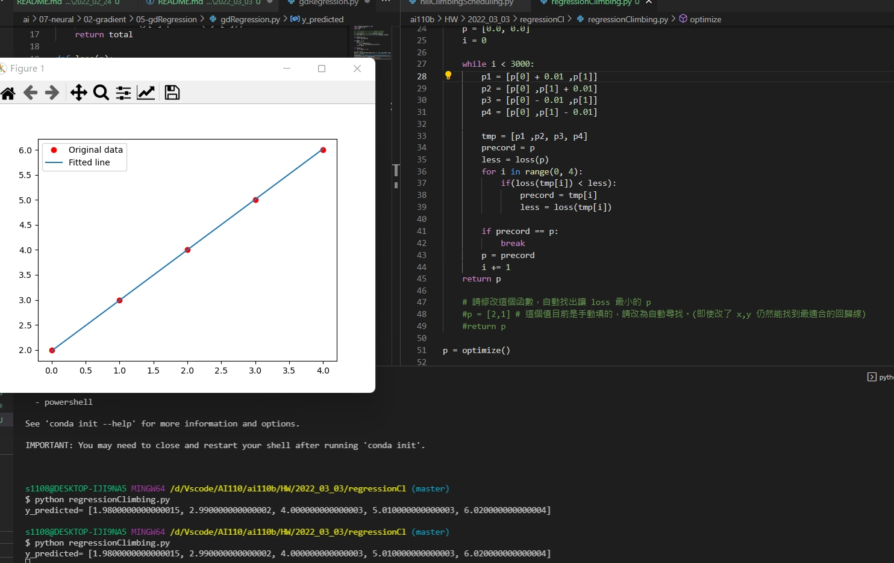

# 爬山演算法的作業
* 運用regression結合爬山演算法的方式來自動化來搜尋，而不是指定值的方式搜尋
* 本作業是參考`鍾誠`老師的[regression.py](https://gitlab.com/ccc110/ai/-/blob/master/_homework/01-regression/regression.py)來改寫的

* 目的，運用4個方向的搜尋，來使用

```
# 請修改這個函數，自動找出讓 loss 最小的 p
#p = [2,1] # 這個值目前是手動填的，請改為自動尋找。(即使改了 x,y 仍然能找到最適合的回歸線)
```
* 這邊是我完全自己修改的地方，其中我運用四個方向的搜尋來做自動搜尋
* 作法是足一進行比較x,y
```
def optimize():
    p = [0.0, 0.0]
    i = 0

    while i < 3000:
        p1 = [p[0] + 0.01 ,p[1]]
        p2 = [p[0] ,p[1] + 0.01]
        p3 = [p[0] - 0.01 ,p[1]]
        p4 = [p[0] ,p[1] - 0.01]

        tmp = [p1 ,p2, p3, p4]
        precord = p
        less = loss(p)
        for i in range(0, 4):
            if(loss(tmp[i]) < less):
                precord = tmp[i]
                less = loss(tmp[i])
                
        if precord == p:
            break
        p = precord
        i += 1
    return p
```

* 執行結果

