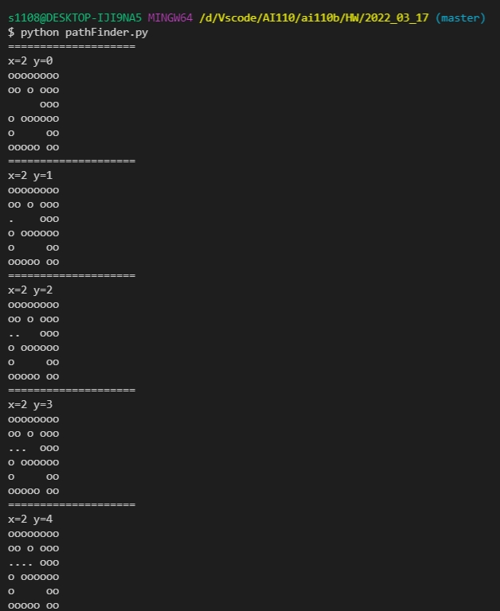
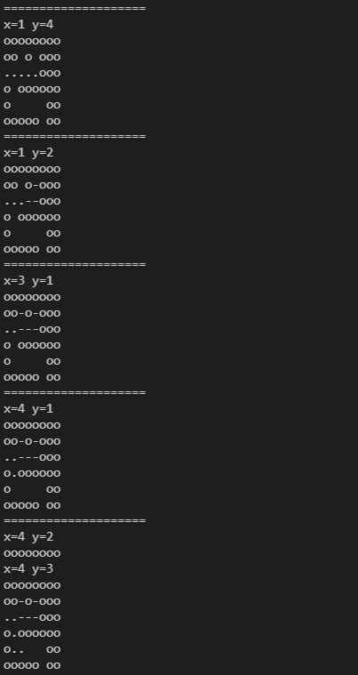
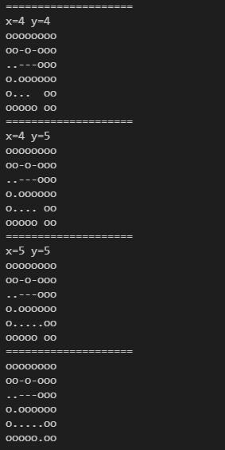

# 習題練習(老鼠走迷宮問題)

* 參考志鍾誠老師的老鼠走迷宮
---

* 用python進行撰寫
* 新增可以找出所走過之路徑，並且用特殊符號標示出最佳路徑

* 老鼠走迷宮之結果

    
    
    


* 老鼠走迷宮的整段程式碼
    ```py
    # 這邊主要是印出整張路徑圖
    def matrixPrint(path):
        for i in range(0,len(path)): #在全路徑上跑for迴圈
            print(path[i]) #印出迷宮地圖


    def strset(s, i, c):
        return s[0:i] + c + s[i+1:]

    def findPath(path, x, y):
        print("="*20)
        print("x="+ str(x) + " y=" + str(y))
        matrixPrint(path)
        if x>=6 or y>=8:
            return False
        if path[x][y] == 'o':
            return False
        if path[x][y] == '-':
            return False
        if path[x][y] == ' ':
            path[x] = strset(path[x], y, '.')
        if path[x][y] == '.':
            if x == 5 or y == 7:
                return True

        if y < 7 and path[x][y+1] == ' ':
            if findPath(path, x, y+1):
                return True
            else: path[x] = strset(path[x], y+1, '-')
        if x < 5 and path[x+1][y] == ' ':
            if findPath(path, x+1, y):
                return True
            else: path[x+1] = strset(path[x+1], y, '-')
        if y > 0 and path[x][y-1] == ' ':
            if findPath(path, x, y-1):
                return True
            else: path[x] = strset(path[x], y-1, '-')
        if x < 5 and path[x-1][y] == ' ':
            if findPath(path, x-1, y):
                return True
            else: path[x-1] = strset(path[x-1], y, '-')

        #path[x][y] = '+'
        return False
        


    path = ["oooooooo",
            "oo o ooo",
            "     ooo",
            "o oooooo",
            "o     oo",
            "ooooo oo"]

    findPath(path, 2, 0)
    print("="*20)
    matrixPrint(path)

    # print(path)
    ```