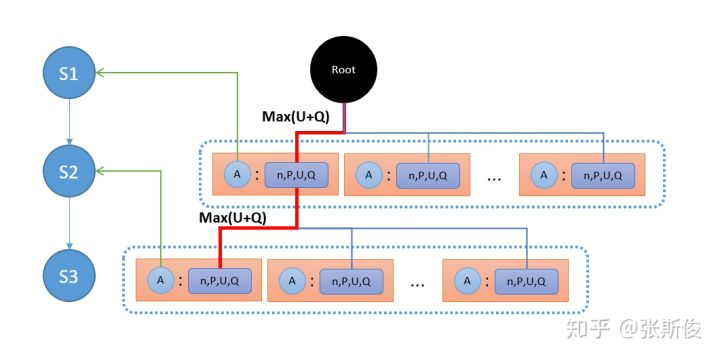

# Midterm (五子棋AlphaZero)
>* 深入了解蒙地卡羅法
>* 深入了解深度學習網路架構
>* 介紹AlphaZero五子棋之程式運行方式
>* 網路架構圖
>* 嘗試改編鍾誠老師讓我們參考的程式架構


- https://github.com/junxiaosong/AlphaZero_Gomoku
---

## 先試試`python human_play.py`及`python train.py`
* 在`python train.py`遇到了一些編譯問題


* 認為所遇到的問題的原因，因為要使用gpu版本的pytouch，但是有些之前安裝過的套件包，造成相互衝突

* 解決方法
    * 我刪除了caffe2_module_test_dynamic.dll，caffe2_observers.dll等一些檔案


## 蒙地卡羅法

- 示意圖

    

1. selection

    從當前節點開始，如果當前節點不是葉節點（存在多個子節點），則每次選擇一個“最值得探索”的子節點。

2. expansion

    如果遊戲還未結束，則根據策略網絡快 速計算下一手的可能落點概率，生成當前節點的子節點。

3. simulation

    從根節點開始模擬完成一次棋局，也稱為playout 或者rollout，從根節點開始，根據MCTS策略選擇每一步的落子（根據概率隨機探索），一直到遊戲結束（達到葉節點），葉節點的值為[1勝利, 0平局, -1失敗]。 
    
    要注意，根節點是指當前的棋盤狀態，並不是每次都從第一手開始模擬。

4. backpropagation

    根據葉節點值，回溯到根節點，更新回溯路徑上每個節點的價值以及訪問次數。這樣，MCTS樹的節點價值就被不斷修正，下次再進行Select的時候，就可以找到更高價值的落子，AI的棋力就提高了。

- 參考網址及圖片來自 : https://zhuanlan.zhihu.com/p/437270327


## 深度學習網路架構

- 輸入

    使用了4個的二值特徵平面，其中前兩個平面分別表示當前player的棋子位置和對手player的棋子位置，有棋子的位置是1，沒棋子的位置是0. 然後第三個平面表示對手player最近一步的落子位置，也就是整個平面只有一個位置是1，其餘全部是0. 第四個平面，也就是最後一個平面表示的是當前player是不是先手player，如果是先手player則整個平面全部為1，否則全部為0

- 隱藏層
 
    公共的3層全卷積網絡，分別使用32、64和128個的filter，使用ReLu激活函數。

- 輸出

    - policy

        這一端，先使用4個的filter進行降維，再接一個全連接層，使用softmax非線性函數直接輸出棋盤上每個位置的落子概率

    - value

        這一端，先使用2個的filter進行降維，再接一個64個神經元的全連接層，最後再接一個全連接層，使用tanh非線性函數直接輸出之間的局面評分。

- 參考網址 : https://read01.com/LdP2My5.html

## 介紹AlphaZero五子棋之程式運行方式

- train

    
    一開始進入程式時會進行初始化(initialize)棋盤、蒙地卡羅樹等。
    接著，會開始自我對局(蒙地卡羅)，其中有四個部分，分別為(select,simulate,board evalute,update node)，用下很多次的方式，算出這些點的勝率是多少，並且記錄下最好的，並且將其記住。

    - select

        

        select主要是按照MAX(Q+U)來做選擇，並且找到子節點，如圖所示。

        其用來計算MAX(Q+U)程式碼如下，將其包裝在get_value函式中
        ```py
        def select(self, c_puct):
            return max(self._children.items(),
                    key=lambda act_node: act_node[1].get_value(c_puct))


        def get_value(self, c_puct):
            self._u = (c_puct * self._P *
                    np.sqrt(self._parent._n_visits) / (1 + self._n_visits))
            return self._Q + self._u

        ```

    - simulate

        接著，會複製棋盤進行模擬，因為需要保留原先的棋盤，並且將複製的那份去進行尋找最好的地方下棋，並且將認為最好的，最後下回初始的棋盤上。

        ```py
        for n in range(self._n_playout):
            state_copy = copy.deepcopy(state)
            self._playout(state_copy)
        ```


    - board evaluate

        

        但是找到子節點之後，還沒有找到最終的狀態，所以需要繼續將蒙地卡羅樹繼續擴張

        ```py
        def expand(self, action_priors):
            for action, prob in action_priors:
                if action not in self._children:
                    self._children[action] = TreeNode(self, prob)
        ```


    - update node
        
        最後無論子節點是在最終狀態還是需要繼續更新，它都需要進行Update
        更新內容:
        1. self._n_visits : 拜訪的次數增加1
        2. self._Q : 更新子節點為其平均
        
        ```py
        def update(self, leaf_value):
            # Count visit.
            self._n_visits += 1
            # Update Q, a running average of values for all visits.
            self._Q += 1.0*(leaf_value - self._Q) / self._n_visits
        ```
    
    
- select，expand圖片來自:https://zhuanlan.zhihu.com/p/115867362


## 網路架構圖
- 我透過[PyTorch下的可視化工具](https://zhuanlan.zhihu.com/p/220403674)，運用程式碼製作之圖，[繪圖之程式碼](./touchviz/touchviz.py)

- 如圖為五子棋AlphaZero的網路架構圖


- 在本網路架構中會有兩個輸出
- 第一個輸出 :   
    1. 一開始會輸出4個棋盤
    2. 輸出32特徵圖卷積層
    3. 輸出64特徵圖卷積層
    4. 輸出128特徵圖卷積層
    5. 輸出4特徵圖卷積層
    6. 輸出1特徵圖全連接層

- 第二個輸出 :
    1. 使用log_softmax讓值介於0~1之間的機率
    2. 輸出2特徵圖卷積層
    3. 輸出64特徵值全連接層
    4. 輸出1特徵值全連接層
    5. 使用tanh讓值介於-1~1之間的分數

- 此處為其網路架構之程式碼，及理解後的註解說明
    ```py
    class Net(nn.Module):
        """policy-value network module"""
        def __init__(self, board_width, board_height):
            super(Net, self).__init__()

            self.board_width = board_width
            self.board_height = board_height
            # common layers
            self.conv1 = nn.Conv2d(4, 32, kernel_size=3, padding=1)   #輸入大小4個棋盤，輸出32棋盤 kernel_size 表示卷積層的長和寬(kernel_size=3就是3*3的卷積核) ，padding 表示往外一圈為0的值
            self.conv2 = nn.Conv2d(32, 64, kernel_size=3, padding=1)
            self.conv3 = nn.Conv2d(64, 128, kernel_size=3, padding=1)
            # action policy layers
            self.act_conv1 = nn.Conv2d(128, 4, kernel_size=1)
            self.act_fc1 = nn.Linear(4*board_width*board_height,
                                    board_width*board_height)
            # state value layers
            self.val_conv1 = nn.Conv2d(128, 2, kernel_size=1)
            self.val_fc1 = nn.Linear(2*board_width*board_height, 64)
            self.val_fc2 = nn.Linear(64, 1) # Linear 全連接層

        def forward(self, state_input):
            # common layers
            x = F.relu(self.conv1(state_input))
            x = F.relu(self.conv2(x))
            x = F.relu(self.conv3(x))
            # action policy layers
            x_act = F.relu(self.act_conv1(x)) #relu激發含式，讓輸入能讓機器比較了解
            x_act = x_act.view(-1, 4*self.board_width*self.board_height) #轉換成Linear
            x_act = F.log_softmax(self.act_fc1(x_act)) #softmax 想成機率，log_softmax()，全部input轉成0~1之間並且加總 = 1
            # state value layers
            x_val = F.relu(self.val_conv1(x))
            x_val = x_val.view(-1, 2*self.board_width*self.board_height)
            x_val = F.relu(self.val_fc1(x_val))
            x_val = F.tanh(self.val_fc2(x_val))
            return x_act, x_val # 棋盤的下子機率，另一個式棋盤的分數
    ```

- 透過程式自己分析網路架構執行結果


## 結果
- 我使用gif

.gif)
